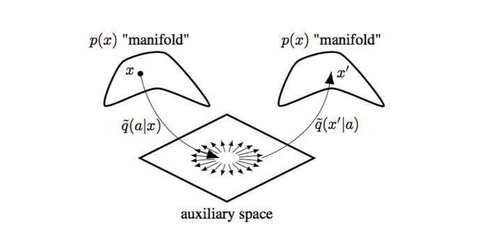

# Auxiliary Variational MCMC

This repository contains code needed to reproduce or extend the experiments in the ICLR submission [Auxiliary Variational MCMC]().
The repository contains code both to draw samples using Auxiliary Variational MCMC and also [A-NICE-MCMC]() and [L2HMC](). We
would like to extend their thanks to the authors of both these papers for open sourcing their code and we have included lightly
edited versions of their code here.

## Dependencies

The dependencies are Numpy, Matplotlib, Tensorflow and Tensorflow_probability.

## Usage

To run any given experiment, simply copy the file from the experiments folder, put it in the top level directory and run it with python3.
Each experiment specifies the possible hyper-parameters as command line arguments.

## How does it work? 

The Auxiliary Variational Sampler works by fitting an auxiliary variable model to a distribution we want to sample from and
then using that model to guide a random walk Metroplis-like sampler. In high dimensions our target distribution is likely to 
have high probability only close to some low-dimensional manifold. The traditional Random-Walk-Metropolis Algorithm proposes
new samples by perturbing the most recent sample in an arbitrary direction, usually based on a Gaussian proposal.
However, in high-dimensional spaces almost all directions will correspondto steps off the manifold of high probability
and thus out of the typical set. In our case, we perform the random perturbation in the low-dimensional auxiliary space 
and our variational distribution ensures that this move remains within the manifold of high density.

The process is depicted in the cartoon below.

